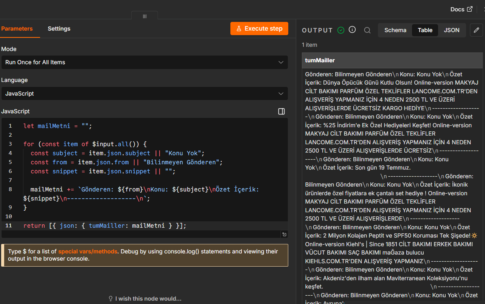
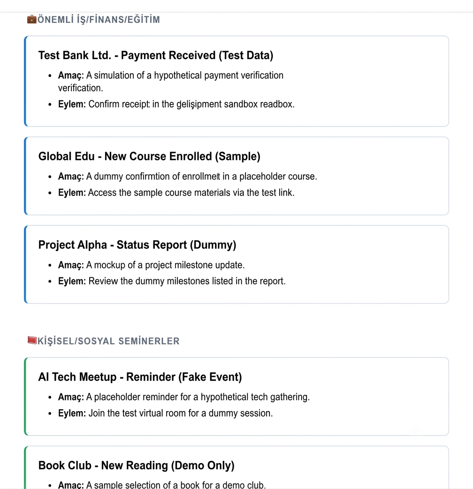

---
# 📧 AI Weekly Gmail Digest with n8n

An automated workflow built with **n8n** and **Google Gemini** that summarizes Gmail emails into a clean weekly HTML digest.
## 📸 Workflow Overview

The workflow automatically retrieves Gmail messages, processes them with JavaScript, sends them to Google Gemini for analysis, and delivers a clean HTML summary email.

  

---

## 🤖 AI Processing

Google Gemini analyzes incoming emails, categorizes them into meaningful groups, extracts action items, and generates a modern HTML email report.

  

---

## 📧 Generated Email

Example of the final AI-generated HTML email delivered to the user's inbox.

  

